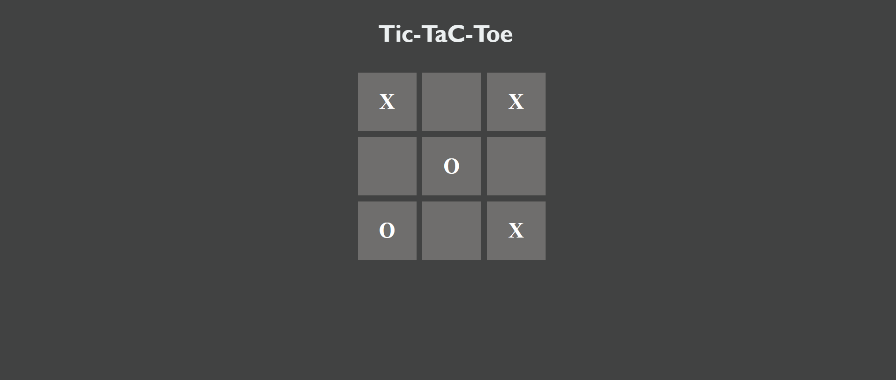

# Tic-Tac-Toe Game

This is a simple implementation of the classic Tic-Tac-Toe game using React.

## Table of Contents

- [Description](#description)
- [Installation](#installation)
- [Usage](#usage)
- [Features](#features)
- [Contributing](#contributing)
- [License](#license)

## Description

This project is a web-based Tic-Tac-Toe game built with React. It allows two players to take turns clicking on the squares to make their moves. The game announces the winner when a player has won, and it provides an option to play again.

## Demo Image



  

## Installation

 
**Clone Repository**
   ```bash
   git clone https://github.com/Shivanshu-Tyagi/Tic-Tac-Toe.git
   ```

   ```
npm install
npm run dev
```

## Usage

To start the game, click on the squares to make your moves. The game will announce the winner when a player has won, and it will provide an option to play again.

## Features

- Two players turn-based gameplay.
- Winning announcement.
- Option to play again.

## Contributing

This project welcomes contributions. 

- Fork the repository.
- Create a new branch for your feature or bug fix.
- Make your changes and commit them.
- Push your changes to your fork.
- Submit a pull request.
